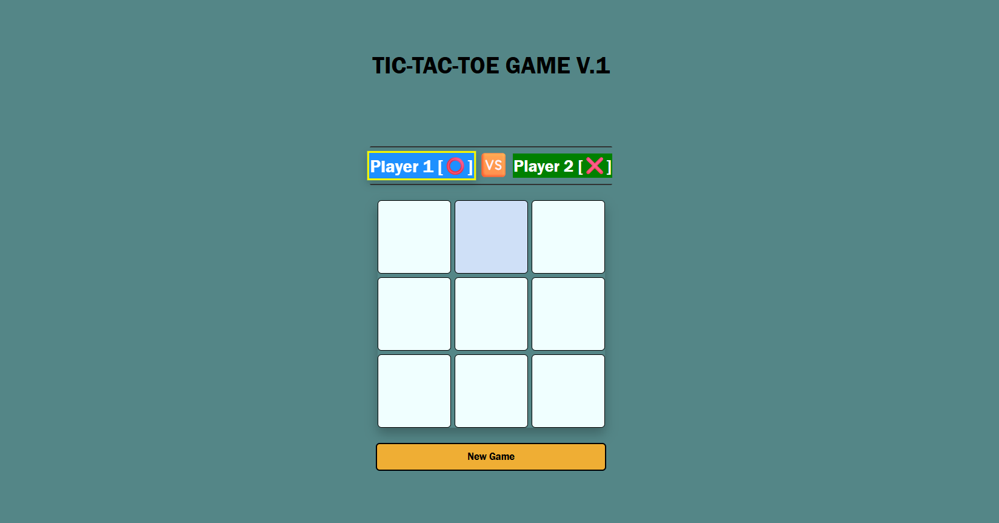

# 🎮 Tic Tac Toe Game (v1)

A clean and interactive **Tic Tac Toe game** built using **HTML, CSS Grid, and JavaScript**.
This project focuses on game logic, UI clarity, and smooth user experience without using alerts.

---

## ✨ Features

* 🧑‍🤝‍🧑 Two-player mode (Player 1 ⭕ vs Player 2 ❌)
* 🔄 Turn indicator with active player highlight
* 🏆 Win detection for all possible patterns
* 🤝 Draw detection
* 🎉 Custom win/draw message box (no `alert()`)
* 🔁 New Game reset functionality
* 🎨 Clean UI with CSS Grid & animations

---

## 🛠️ Technologies Used

* **HTML5**
* **CSS3 (Grid & Flexbox)**
* **Vanilla JavaScript**

---

## 📸 Preview

---

## ▶️ How to Play

1. Player 1 starts with **⭕**
2. Player 2 plays with **❌**
3. Players take turns clicking on the grid
4. First player to align **3 symbols** in a row, column, or diagonal wins
5. If all boxes are filled with no winner → **Draw**

---

## 🚀 Live Demo 

👉🏼 https://amit-dubey-007.github.io/tic-tac-toe-v1/

---

## 🧠 What I Learned

* Handling game state using arrays
* Implementing win/draw logic efficiently
* DOM manipulation & event handling
* UI state management without alerts
* Writing clean and readable JavaScript

---

## 🔮 Future Improvements

* Single-player mode (vs Computer)
* Scoreboard using LocalStorage
* Sound effects & background music
* Mobile-first UI enhancements

---

## 🙌 Author

**Amit**
M.Tech IT (Integrated) Student
Aspiring Web Developer 🚀

---

⭐ If you like this project, feel free to star the repo!

